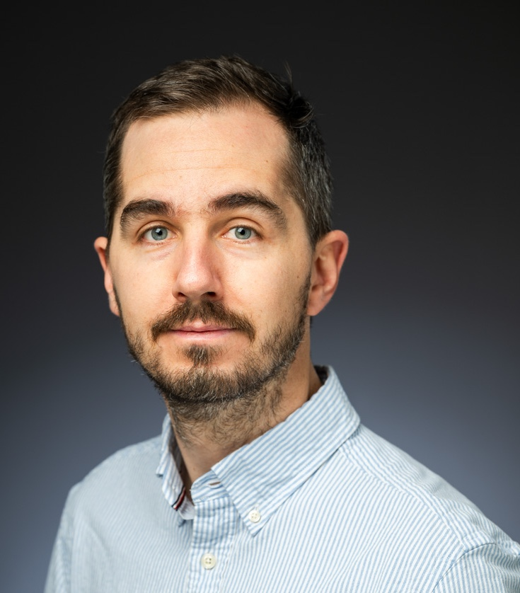

I graduated cum laude in mechanical engineering from the University of Pisa in 2015.
From 2015 to 2017 I was a PhD student in robotics at the [Research Center E. Piaggio](https://www.centropiaggio.unipi.it), University of Pisa, and the [Istituto Italiano di Tecnologia (IIT)](https://www.iit.it/en-US/).
Since 2017 I am at the [Computer Science and Artificial Intelligence Laboratory (CSAIL)](https://www.csail.mit.edu), Massachusetts Institute of Technology (MIT), to continue my PhD studies; my major is in computer science and my minor in mathematics.
My main research interests are control theory, numerical optimization, and robotics.
