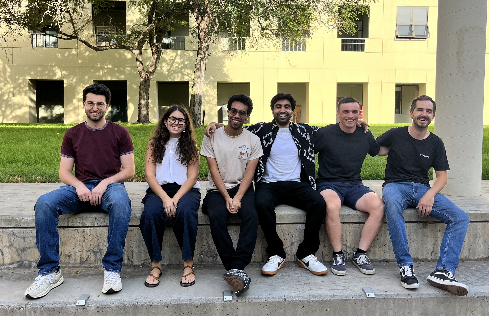

The Robot Optimization and Learning Lab (ROLL) develops the mathematical foundations of high-performance robot planning, control, and learning.

### Graduate students

- [Andres Torres](https://www.hawkeslab.com/andres-torres-about) (co-advised with Elliot Hawkes)
- [Cayetana Salinas Rodríguez](https://www.linkedin.com/in/cayetana-salinas/) (co-advised with Jason Marden)
- [John-Paolo Casasanta](https://www.linkedin.com/in/john-paolo-casasanta-070105224/)
- [Jonathan Lane](https://www.linkedin.com/in/jonathan-lane-58b226233/)
- [Yufeiyang Gao](https://yufeiyg.github.io/) (co-advised with James Preiss)

### Undergraduate students

- [Mayand Gulati](https://www.linkedin.com/in/mayand-gulati-43aa3a381/)
- [Susan Clay](https://www.linkedin.com/in/susan-clay-6b4b4a26b/)