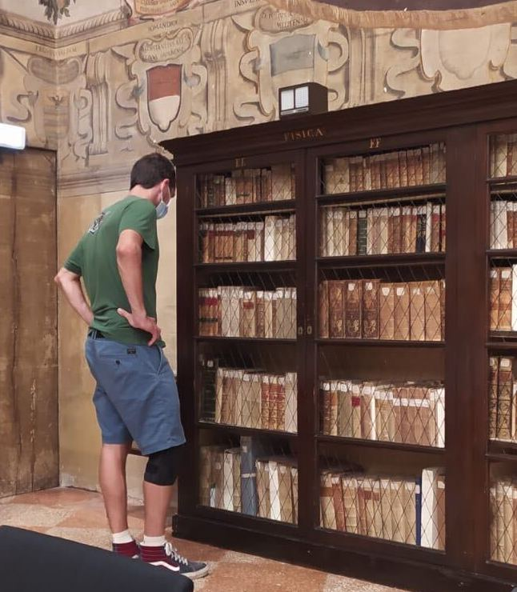

---
# Feel free to add content and custom Front Matter to this file.
# To modify the layout, see https://jekyllrb.com/docs/themes/#overriding-theme-defaults

layout: page
---

I am an Assistant Professor in the [Department of Electrical and Computer Engineering at the University of California, Santa Barbara (UCSB)](https://www.ece.ucsb.edu).
My research is centered on Graphs of Convex Sets (GCS), a new framework for decision making that blends combinatorial and convex optimization.
If you want to know more about GCS, you can [watch my thesis defense](https://www.youtube.com/watch?si=mfF1A1s-H87eznmV&v=rSbpfAVF_7c&feature=youtu.be) or [read this paper](https://arxiv.org/pdf/2510.20184).

<h3 style="color: maroon;">Recruiting PhD students</h3>

I am seeking highly motivated PhD students to join my newly established research group at UCSB. The research will focus on developing novel optimization algorithms for robot motion planning and control. For an example of this research direction, you can view [my PhD thesis](https://dspace.mit.edu/handle/1721.1/156598). Candidates with a background in robotics and/or optimization are strongly encouraged to apply. The admission process is handled by the ECE department, and the deadline for applications is December 15, 2025. Additional information can be found [here](https://www.ece.ucsb.edu/grad/apply). If you are interested in applying or would like more information about these positions, feel free to email me.

<h3 style="color: maroon;">News</h3>

- I'll be giving a talk at the [CVXPY Workshop](https://www.cvxpy.org/workshop/2026/).
- Autonomy Talk titled "[A Tutorial on Graphs of Convex Sets](https://www.youtube.com/watch?v=N-qSSUX83Rk)".
- [New paper](https://arxiv.org/pdf/2510.20184) that builds on my PhD thesis. I encourage you to check it out if you’re interested in GCS. Any feedback is greatly appreciated!
- Major cleanup to the Python library [GCSOPT](https://github.com/TobiaMarcucci/gcsopt) for solving GCS problems. It’s now pip-installable, thoroughly tested, and (hopefully) straightforward to use.
- I’ll be co-organizing the [17th World Symposium on the Algorithmic Foundations of Robotics (WAFR)](https://algorithmic-robotics.org), taking place June 15–17, 2026, in Oulu, Finland. I invite you to submit your work: the deadline for paper submissions is January 15, 2026. Looking forward to seeing you in Finland!
